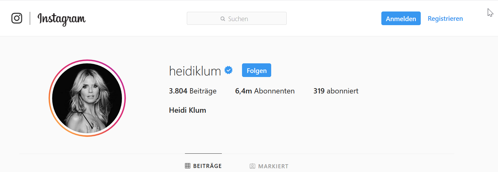

More about this website.

I try to print this <b> bold </b>.

I will link to the main page here <a href="index.html">here</a>.

And <a href="newpage.html">this</a> will link to a new page, not mentioned in the nav bar.

This picture links to the same page:

<a href="newpage.html"> <a href="newpage.html"> <a href="newpage.html">

<a href="newpage.html"> <a href="newpage.html"> <a href="newpage.html">